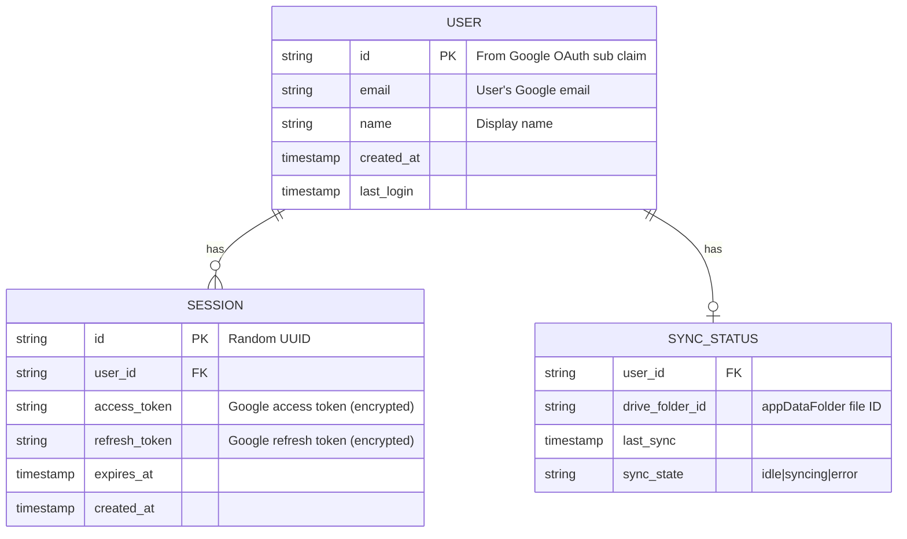

# Phase 1: Authentication & Core Shell

## Overview

Implement complete authentication flow using Google OAuth with Supabase, build a responsive mobile-first app shell with Today/Plan/Reflect bottom navigation, and establish Google Drive connection for cloud sync.

**Parent Epic:** clarity-1f4
**Depends On:** Phase 0 (clarity-0ch) - Foundation & Technical Spikes
**Blocks:** Phase 2 (clarity-pzg) - Captures & Local-First Data

## Problem Statement

Users need a secure way to authenticate with the Clarity app that works seamlessly across web and iOS platforms. After authentication, they need intuitive navigation to access the core features: daily inbox/check-ins (Today), planning tools (Plan), and reflection views (Reflect). All user data must sync securely to Google Drive.

**Current State:**
- Google OAuth with PKCE is partially implemented (`src/lib/google-auth.ts`)
- Token storage uses Preferences (not secure storage)
- No Supabase client configured
- Only demo route exists - no authentication UI or navigation
- 6 P1 security vulnerabilities in existing auth code
- Google Drive sync engine exists but is not connected to auth flow

## Proposed Solution

### Architecture

```
┌─────────────────────────────────────────────────────────────────┐
│                         App Entry                               │
│                      src/routes/__root.tsx                      │
└─────────────────────────────────────────────────────────────────┘
                              │
                    ┌─────────┴─────────┐
                    │                   │
              ┌─────▼─────┐       ┌─────▼─────┐
              │  /login   │       │   /_app   │
              │  Public   │       │ Protected │
              └───────────┘       └─────┬─────┘
                                        │
                    ┌───────────────────┼───────────────────┐
                    │                   │                   │
              ┌─────▼─────┐       ┌─────▼─────┐       ┌─────▼─────┐
              │  /today   │       │   /plan   │       │ /reflect  │
              │ Inbox +   │       │ NorthStar │       │ Reviews + │
              │ Check-in  │       │ + Goals   │       │  Memory   │
              └───────────┘       └───────────┘       └───────────┘
```

### Key Components

1. **AuthProvider** - React context managing authentication state
2. **Supabase Client** - Session management and analytics
3. **Protected Routes** - TanStack Router `beforeLoad` guards
4. **AppShell** - Bottom tab navigation with safe area handling
5. **Secure Storage** - iOS Keychain via Capacitor plugin

## Technical Approach

### Phase 1A: Security Fixes (Foundation)

Address 6 P1 security issues before proceeding:

| Todo | Issue | Fix |
|------|-------|-----|
| 008 | OAuth state not validated | Store state, validate on callback |
| 009 | Deep link origin not validated | Check scheme matches `clarity://` |
| 010 | PKCE verifier not stored securely | Use secure storage plugin |
| 011-013 | Type safety issues | Fix type assertions |

**Files to modify:**
- `src/lib/google-auth.ts:25-45` - Add state validation
- `src/lib/deep-links.ts:12-28` - Add origin validation
- `src/lib/token-service.ts:8-15` - Migrate to secure storage

### Phase 1B: Supabase Integration

**Decision Required:** Use Supabase Auth OR keep existing Google OAuth with Supabase for analytics only.

**Recommended Approach:** Keep existing Google OAuth (already works), add Supabase client for:
- Analytics and usage tracking
- Future subscription management
- (Optional) Session backup to Supabase

**Files to create:**
- `src/lib/supabase.ts` - Supabase client initialization

```typescript
// src/lib/supabase.ts
import { createClient } from '@supabase/supabase-js';
import { Preferences } from '@capacitor/preferences';

const supabaseUrl = import.meta.env.VITE_SUPABASE_URL;
const supabaseAnonKey = import.meta.env.VITE_SUPABASE_ANON_KEY;

const capacitorStorage = {
  getItem: async (key: string) => {
    const { value } = await Preferences.get({ key });
    return value;
  },
  setItem: async (key: string, value: string) => {
    await Preferences.set({ key, value });
  },
  removeItem: async (key: string) => {
    await Preferences.remove({ key });
  },
};

export const supabase = createClient(supabaseUrl, supabaseAnonKey, {
  auth: {
    storage: capacitorStorage,
    autoRefreshToken: true,
    persistSession: true,
  },
});
```

### Phase 1C: Authentication UI & Flow

**Files to create:**
- `src/routes/login.tsx` - Login screen with Google OAuth button
- `src/routes/oauth/callback.tsx` - OAuth callback handler
- `src/lib/auth-context.tsx` - React context for auth state
- `src/components/login-button.tsx` - Styled Google sign-in button

**Auth Flow (iOS):**
```
1. App launch → check isAuthenticated()
2. No tokens → render /login route
3. User taps "Sign in with Google"
4. Generate + store PKCE verifier (secure storage)
5. Generate + store state parameter
6. Open Google OAuth URL in ASWebAuthSession
7. User authenticates → redirects to clarity://oauth/callback
8. Deep link triggers appUrlOpen event
9. Validate state parameter
10. Exchange code for tokens
11. Store tokens (secure storage)
12. Navigate to /_app/today
```

**Login Screen Mockup:**
```
┌─────────────────────────────────────┐
│                                     │
│           [Clarity Logo]            │
│                                     │
│      Your personal operating        │
│           system for life           │
│                                     │
│                                     │
│   ┌─────────────────────────────┐   │
│   │  [G] Sign in with Google    │   │
│   └─────────────────────────────┘   │
│                                     │
│                                     │
│    By signing in, you agree to      │
│    our Terms and Privacy Policy     │
│                                     │
└─────────────────────────────────────┘
```

### Phase 1D: App Shell & Navigation

**Files to create:**
- `src/routes/_app.tsx` - Protected layout with bottom nav
- `src/routes/_app/today.tsx` - Today tab (Inbox + Check-in)
- `src/routes/_app/plan.tsx` - Plan tab (North Star + Goals)
- `src/routes/_app/reflect.tsx` - Reflect tab (Reviews + Memory)
- `src/components/bottom-nav.tsx` - Bottom tab bar component
- `src/components/app-shell.tsx` - Layout wrapper with safe areas

**Bottom Navigation Component:**
```tsx
// src/components/bottom-nav.tsx
import { Link, useLocation } from '@tanstack/react-router';
import { Calendar, ClipboardList, BookOpen } from 'lucide-react';
import { cn } from '@/lib/utils';

const tabs = [
  { path: '/today', label: 'Today', icon: Calendar },
  { path: '/plan', label: 'Plan', icon: ClipboardList },
  { path: '/reflect', label: 'Reflect', icon: BookOpen },
];

export function BottomNav() {
  const { pathname } = useLocation();

  return (
    <nav className="fixed bottom-0 left-0 right-0 bg-background border-t border-border
                    h-[calc(60px+env(safe-area-inset-bottom))]
                    pb-[env(safe-area-inset-bottom)]">
      <div className="flex justify-around items-center h-[60px]">
        {tabs.map(({ path, label, icon: Icon }) => {
          const isActive = pathname.startsWith(path);
          return (
            <Link
              key={path}
              to={path}
              className={cn(
                "flex flex-col items-center justify-center min-w-[64px] py-2",
                "touch-manipulation",
                isActive ? "text-primary" : "text-muted-foreground"
              )}
            >
              <Icon className={cn("h-6 w-6", isActive && "fill-current")} />
              <span className={cn("text-xs mt-1", isActive && "font-semibold")}>
                {label}
              </span>
            </Link>
          );
        })}
      </div>
    </nav>
  );
}
```

### Phase 1E: Google Drive Connection

**Files to modify:**
- `src/lib/google-auth.ts` - Already requests `drive.appdata` scope
- `src/lib/sync/use-sync.ts` - Connect to auth state

**Connection Flow:**
1. Google OAuth already requests `drive.appdata` scope
2. On successful auth, Drive access is granted
3. Sync hook initializes on /_app mount
4. Settings screen shows Drive connection status

## Acceptance Criteria

### Functional Requirements

- [ ] User can sign in with Google on iOS app
- [ ] User can sign in with Google on web app
- [ ] App remembers session across restarts
- [ ] Invalid/expired tokens trigger re-authentication prompt
- [ ] Bottom navigation shows Today/Plan/Reflect tabs
- [ ] Tapping tab navigates to correct view
- [ ] Active tab is visually highlighted
- [ ] Safe areas respected on iOS (notch, home indicator)
- [ ] Google Drive connected after successful auth
- [ ] User can sign out from the app

### Non-Functional Requirements

- [ ] OAuth flow completes in < 5 seconds (excluding user interaction)
- [ ] Token refresh happens transparently without user intervention
- [ ] App shell renders in < 200ms after authentication
- [ ] Tokens stored in iOS Keychain (not Preferences)
- [ ] All P1 security issues resolved

### Quality Gates

- [ ] All existing tests pass (`npm test`)
- [ ] TypeScript compiles without errors (`npm run typecheck`)
- [ ] Builds successfully for iOS (`npm run build:ios`)
- [ ] OAuth flow tested on device (not just simulator)
- [ ] Manual testing of edge cases (token expiry, network loss)

## Success Metrics

| Metric | Target | Measurement |
|--------|--------|-------------|
| Auth success rate | > 95% | Track failed OAuth attempts |
| Time to first interaction | < 3s | From app launch to usable shell |
| Session restoration rate | > 99% | Returning users auto-signed in |
| Token refresh success | > 99% | Silent refresh without re-auth |

## Dependencies & Prerequisites

### External Dependencies
- Google Cloud Console project with OAuth client configured
- Supabase project (for analytics/future features)
- Apple Developer account (for App Store submission)

### Internal Dependencies
- Phase 0 complete (Capacitor, Dexie, Google Drive sync engine)
- Tailwind CSS v4 + shadcn/ui configured

### Required Packages
```bash
npm install @supabase/supabase-js
npm install @aparajita/capacitor-secure-storage
```

## Risk Analysis & Mitigation

| Risk | Likelihood | Impact | Mitigation |
|------|------------|--------|------------|
| OAuth callback fails on iOS | Medium | High | Extensive testing with ASWebAuthSession |
| Token refresh race condition | Medium | Medium | Mutex lock around refresh calls |
| Deep link hijacking | Low | High | Validate origin before processing |
| Keychain access denied | Low | Medium | Fallback to Preferences with warning |
| Supabase service outage | Low | Low | Supabase is analytics-only, app works without it |

## Resource Requirements

### Development
- 1 developer, estimated 3-5 focused sessions
- iOS device for testing OAuth flow
- Access to Google Cloud Console
- Access to Supabase dashboard

### Infrastructure
- Supabase project (free tier sufficient for development)
- Google Cloud project with OAuth consent screen configured

## Future Considerations

### Phase 2 Integration Points
- Auth state available for sync operations
- User ID for per-user Drive folder organization
- Token refresh integrated with sync timing

### Extensibility
- Auth context can support additional providers (Apple, email)
- Bottom nav can add 4th/5th tab if needed
- Protected route pattern reusable for admin-only features

## Documentation Plan

- [ ] Update README with authentication setup instructions
- [ ] Add environment variables to `.env.example`
- [ ] Document OAuth configuration in `docs/authentication.md`
- [ ] Add troubleshooting guide for common auth issues

## References & Research

### Internal References
- Google OAuth implementation: `src/lib/google-auth.ts:1-120`
- Token service: `src/lib/token-service.ts:1-85`
- Deep links: `src/lib/deep-links.ts:1-40`
- Sync engine: `src/lib/sync/processor.ts:1-150`
- Database schema: `src/lib/db/schema.ts:1-80`
- Project specification: `docs/spec.md`

### External References
- [Supabase Google OAuth Guide](https://supabase.com/docs/guides/auth/social-login/auth-google)
- [Capacitor Deep Links](https://capacitorjs.com/docs/guides/deep-links)
- [TanStack Router Authentication](https://tanstack.com/router/latest/docs/framework/react/guide/authenticated-routes)
- [Secure Storage Plugin](https://github.com/nicpjocmm/capacitor-secure-storage-plugin)

### Security Todos (P1)
- `todos/008-pending-p1-oauth-state-validation.md`
- `todos/009-pending-p1-deep-link-origin-validation.md`
- `todos/010-pending-p1-pkce-verifier-storage.md`
- `todos/011-pending-p1-unsafe-type-assertion-processor.md`
- `todos/012-pending-p1-untyped-json-response-drive.md`
- `todos/013-pending-p1-non-null-assertion-optional-id.md`

## ERD: Authentication Data Model



Note: User data is stored locally in Dexie. Supabase only tracks analytics events, not user records.

---

## Implementation Checklist

### Phase 1A: Security Fixes
- [ ] Install secure storage plugin
- [ ] Migrate token storage to Keychain
- [ ] Add OAuth state generation and validation
- [ ] Add deep link origin validation
- [ ] Fix type assertions in sync processor
- [ ] Fix untyped JSON in Drive API
- [ ] Close P1 security todos

### Phase 1B: Supabase Setup
- [ ] Create Supabase project
- [ ] Add environment variables
- [ ] Create supabase client with Capacitor storage adapter
- [ ] Test connection from app

### Phase 1C: Authentication UI
- [ ] Create AuthContext provider
- [ ] Create login route and component
- [ ] Create OAuth callback route
- [ ] Wire up deep link listener
- [ ] Test full auth flow on iOS
- [ ] Test full auth flow on web

### Phase 1D: App Shell
- [ ] Create BottomNav component
- [ ] Create AppShell layout wrapper
- [ ] Create protected /_app layout route
- [ ] Create /today route (placeholder content)
- [ ] Create /plan route (placeholder content)
- [ ] Create /reflect route (placeholder content)
- [ ] Add route protection with beforeLoad
- [ ] Test navigation on iOS and web

### Phase 1E: Google Drive Connection
- [ ] Verify Drive scope in OAuth flow
- [ ] Initialize sync on app mount
- [ ] Add connection status indicator
- [ ] Test sync after fresh auth

### Final Verification
- [ ] All acceptance criteria met
- [ ] TypeScript compiles clean
- [ ] iOS build succeeds
- [ ] Manual QA on physical device
