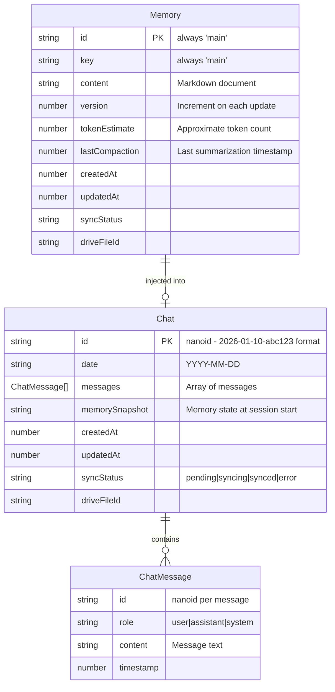

# Phase 3: AI Chat with Memory

**Epic:** clarity-ay6
**Priority:** P2
**Type:** Feature
**Created:** 2026-01-10

---

## Overview

Add conversational AI capabilities to Clarity with persistent memory context. Users can have natural language conversations with an AI companion that remembers their goals, preferences, and life context across sessions. Streaming responses provide real-time feedback, while markdown-based memory enables transparent, editable personal context.

---

## Problem Statement / Motivation

Clarity captures user thoughts and intentions but currently lacks the ability to engage in dialogue. Users need:

1. **Contextual conversations** - An AI that understands their goals, relationships, and current priorities
2. **Persistent memory** - Context that grows over time without manual curation
3. **Mobile-first chat** - Fast, responsive experience on iOS with offline resilience
4. **Seamless sync** - Conversations available across devices via Google Drive

This is the core interaction model that transforms Clarity from a capture tool into a personal companion.

---

## Proposed Solution

Implement a streaming chat interface using Vercel AI SDK with:

- **Session-based conversations** - 24-hour gap creates new session
- **Memory injection** - Markdown document injected into every conversation
- **Local-first storage** - Dexie.js with Google Drive sync
- **Quality-tiered models** - Fast model for chat, quality model for memory extraction

---

## Technical Approach

### Architecture

```
┌─────────────────────────────────────────────────────────────────┐
│                        Clarity App                               │
├─────────────────────────────────────────────────────────────────┤
│  ┌─────────────┐    ┌─────────────┐    ┌─────────────┐         │
│  │  Chat UI    │───▶│ useChat     │───▶│ API Route   │         │
│  │  (React)    │◀───│ (AI SDK)    │◀───│ (Streaming) │         │
│  └─────────────┘    └─────────────┘    └─────────────┘         │
│         │                 │                   │                 │
│         ▼                 ▼                   ▼                 │
│  ┌─────────────┐    ┌─────────────┐    ┌─────────────┐         │
│  │  Keyboard   │    │   Dexie     │    │ Vercel AI   │         │
│  │  Handler    │    │   (Local)   │    │  Gateway    │         │
│  └─────────────┘    └─────────────┘    └─────────────┘         │
│                           │                   │                 │
│                           ▼                   ▼                 │
│                    ┌─────────────┐    ┌─────────────┐          │
│                    │ Google      │    │ OpenAI /    │          │
│                    │ Drive Sync  │    │ Anthropic   │          │
│                    └─────────────┘    └─────────────┘          │
└─────────────────────────────────────────────────────────────────┘
```

### Data Model (ERD)



### File Structure

```
src/
├── lib/
│   ├── ai/
│   │   ├── index.ts              # AI client configuration
│   │   ├── use-ai-chat.ts        # Custom chat hook wrapping AI SDK
│   │   ├── context-builder.ts    # Memory + history assembly
│   │   ├── memory-extractor.ts   # Post-chat learning extraction
│   │   └── prompts.ts            # System prompts
│   ├── chats.ts                  # Chat CRUD operations
│   └── db/
│       ├── schema.ts             # Extended with ChatMessage id
│       └── hooks.ts              # Add useChat, useChatHistory
├── components/
│   ├── chat/
│   │   ├── chat-view.tsx         # Main chat container
│   │   ├── chat-message.tsx      # Individual message bubble
│   │   ├── chat-input.tsx        # Text input with send button
│   │   ├── chat-empty.tsx        # Empty state with suggestions
│   │   └── streaming-indicator.tsx
│   └── chat-fab.tsx              # Floating action button
├── routes/_app/
│   └── chat.tsx                  # Chat route
└── api/
    └── chat.ts                   # Server function for streaming
```

### Google Drive Structure

```
/Clarity
├── memory.md                     # Single memory file (markdown)
└── chats/
    ├── 2026-01-10-abc123.json   # Session files with date prefix
    ├── 2026-01-11-def456.json
    └── ...
```

---

## Implementation Phases

### Phase 3.1: Foundation

**Goal:** Basic chat infrastructure without AI

- [ ] Install dependencies (`ai`, `@ai-sdk/react`, `@ai-sdk/openai`)
- [ ] Extend Dexie schema with ChatMessage.id field
- [ ] Create `src/lib/chats.ts` following captures.ts pattern
- [ ] Add `useChat`, `useChatById`, `useChatHistory` hooks
- [ ] Create basic chat UI components (view, message, input)
- [ ] Add chat route at `/_app/chat`
- [ ] Implement keyboard handling hook for iOS

**Files to create/modify:**
- `src/lib/chats.ts` (new)
- `src/lib/db/schema.ts` (modify)
- `src/lib/db/hooks.ts` (modify)
- `src/lib/use-keyboard.ts` (new)
- `src/components/chat/chat-view.tsx` (new)
- `src/components/chat/chat-message.tsx` (new)
- `src/components/chat/chat-input.tsx` (new)
- `src/routes/_app/chat.tsx` (new)

### Phase 3.2: AI Integration

**Goal:** Streaming AI responses with memory context

- [ ] Create AI configuration (`src/lib/ai/index.ts`)
- [ ] Implement context builder for memory + history assembly
- [ ] Create system prompt with Clarity personality
- [ ] Implement `useAIChat` hook wrapping AI SDK
- [ ] Add server function for streaming API calls
- [ ] Wire up streaming UI with typing indicator
- [ ] Implement session boundary logic (24-hour gap)
- [ ] Add error handling and retry UI

**Files to create:**
- `src/lib/ai/index.ts`
- `src/lib/ai/use-ai-chat.ts`
- `src/lib/ai/context-builder.ts`
- `src/lib/ai/prompts.ts`
- `src/api/chat.ts`
- `src/components/chat/streaming-indicator.tsx`

### Phase 3.3: Memory System

**Goal:** Persistent memory with extraction and sync

- [ ] Create memory service (`src/lib/ai/memory-extractor.ts`)
- [ ] Implement end-of-session memory extraction
- [ ] Add memory compression when approaching limit
- [ ] Update Drive sync for memory.md (markdown format)
- [ ] Update Drive sync for chat folder structure
- [ ] Add memory initialization for new users
- [ ] Implement memory versioning

**Files to create/modify:**
- `src/lib/ai/memory-extractor.ts` (new)
- `src/lib/sync/drive.ts` (modify for new file structure)
- `src/lib/sync/hydrate.ts` (modify for chats folder)

### Phase 3.4: Polish & UX

**Goal:** Production-ready experience

- [ ] Add floating chat button to app shell
- [ ] Implement empty state with conversation starters
- [ ] Add haptic feedback for iOS
- [ ] Implement auto-scroll with user scroll detection
- [ ] Add markdown rendering for AI responses
- [ ] Implement chat history view
- [ ] Add offline indicator and queued message handling
- [ ] Performance optimization (throttled updates)

**Files to create/modify:**
- `src/components/chat-fab.tsx` (new)
- `src/components/chat/chat-empty.tsx` (new)
- `src/lib/haptics.ts` (new)
- `src/components/app-shell.tsx` (modify)

---

## Acceptance Criteria

### Functional Requirements

- [ ] User can send messages and receive streaming AI responses
- [ ] Chat persists to Dexie and syncs to Google Drive
- [ ] Memory document is injected into every conversation
- [ ] 24+ hour gap creates new session automatically
- [ ] Memory is extracted and updated after conversations
- [ ] Chat works offline (queued for sync when online)
- [ ] Previous sessions are accessible from history

### Non-Functional Requirements

- [ ] First token appears within 2 seconds of send
- [ ] Streaming updates at 20+ FPS on iOS
- [ ] Memory stays under 4K tokens (auto-compression)
- [ ] Chat history syncs within 30 seconds of completion
- [ ] No data loss on app background during stream

### Quality Gates

- [ ] TypeScript strict mode passes
- [ ] iOS keyboard handling tested on device
- [ ] Offline → online sync verified
- [ ] Multi-device sync verified
- [ ] Error states have appropriate UI

---

## Technical Considerations

### Context Window Management

Budget allocation for 8K context:
- System prompt: ~500 tokens (fixed)
- Memory: ~2000 tokens (compressed if larger)
- Chat history: ~5000 tokens (truncate oldest)
- User message: ~500 tokens (buffer)

```typescript
// src/lib/ai/context-builder.ts
const CONTEXT_BUDGET = {
  system: 500,
  memory: 2000,
  history: 5000,
  buffer: 500,
};
```

### Session Boundary Logic

```typescript
// Session check on chat open
const shouldCreateNewSession = (lastMessage?: ChatMessage): boolean => {
  if (!lastMessage) return true;
  const hoursSinceLastMessage = (Date.now() - lastMessage.timestamp) / (1000 * 60 * 60);
  return hoursSinceLastMessage >= 24;
};
```

### Memory Extraction Strategy

Extract memory updates at **end of session** (not per-message) to control costs:
- On app background after chat activity
- On explicit session end
- Batch extractions every 15 minutes of active chat

### Model Selection

| Use Case | Model | Rationale |
|----------|-------|-----------|
| Chat responses | gpt-4o-mini / claude-haiku | Fast, cheap, good enough |
| Memory extraction | gpt-4o / claude-sonnet | Quality matters for learning |
| Memory compression | gpt-4o / claude-sonnet | Preserve important context |

---

## Dependencies & Risks

### Dependencies

| Dependency | Status | Notes |
|------------|--------|-------|
| Phase 2 (Captures & Sync) | Complete | Required for Drive sync infrastructure |
| Vercel AI Gateway account | Required | Need API key configuration |
| OpenAI / Anthropic API access | Required | Through gateway or direct |

### Risks

| Risk | Likelihood | Impact | Mitigation |
|------|------------|--------|------------|
| API costs exceed budget | Medium | High | Implement per-user rate limiting, use cheaper models |
| Context overflow mid-session | Low | Medium | Pre-calculate tokens, truncate with warning |
| Memory corruption | Low | High | Version memory, keep backups on Drive |
| iOS keyboard issues | Medium | Medium | Extensive device testing, use Capacitor keyboard plugin |

---

## Success Metrics

- **Engagement:** Average messages per session > 5
- **Retention:** Users returning to chat within 7 days > 60%
- **Performance:** P95 time to first token < 3 seconds
- **Reliability:** Chat completion rate > 99%
- **Cost:** Average cost per user per month < $0.50

---

## MVP Implementation

### chat-view.tsx

```tsx
// src/components/chat/chat-view.tsx
import { useRef, useEffect } from 'react';
import { useAIChat } from '@/lib/ai/use-ai-chat';
import { useMemory } from '@/lib/db/hooks';
import { useKeyboard } from '@/lib/use-keyboard';
import { ChatMessage } from './chat-message';
import { ChatInput } from './chat-input';
import { ChatEmpty } from './chat-empty';
import { StreamingIndicator } from './streaming-indicator';
import { cn } from '@/lib/utils';

interface ChatViewProps {
  chatId: string;
  date: string;
}

export function ChatView({ chatId, date }: ChatViewProps) {
  const memory = useMemory();
  const { isVisible: keyboardVisible } = useKeyboard();
  const messagesEndRef = useRef<HTMLDivElement>(null);

  const {
    messages,
    sendMessage,
    isStreaming,
    error,
    retry,
  } = useAIChat({
    chatId,
    date,
    memoryContext: memory?.content,
  });

  // Auto-scroll to bottom
  useEffect(() => {
    messagesEndRef.current?.scrollIntoView({ behavior: 'smooth' });
  }, [messages, isStreaming]);

  const handleSend = async (content: string) => {
    await sendMessage(content);
  };

  return (
    <div className={cn(
      'flex flex-col h-full',
      'pt-safe-top',
      keyboardVisible ? 'pb-0' : 'pb-safe-bottom'
    )}>
      {/* Messages */}
      <div className="flex-1 overflow-y-auto p-4 space-y-3">
        {messages.length === 0 ? (
          <ChatEmpty onSuggestionTap={handleSend} />
        ) : (
          messages.map((m) => (
            <ChatMessage key={m.id} message={m} />
          ))
        )}
        {isStreaming && <StreamingIndicator />}
        {error && (
          <div className="text-destructive text-center p-4">
            <p>{error.message}</p>
            <button onClick={retry} className="underline">
              Tap to retry
            </button>
          </div>
        )}
        <div ref={messagesEndRef} />
      </div>

      {/* Input */}
      <ChatInput
        onSend={handleSend}
        disabled={isStreaming}
        className={cn(
          'border-t',
          !keyboardVisible && 'pb-safe-bottom'
        )}
      />
    </div>
  );
}
```

### use-ai-chat.ts

```typescript
// src/lib/ai/use-ai-chat.ts
import { useChat } from '@ai-sdk/react';
import { useCallback, useEffect } from 'react';
import { db } from '@/lib/db';
import { generateId } from '@/lib/db/helpers';
import { buildContext } from './context-builder';

interface UseAIChatOptions {
  chatId: string;
  date: string;
  memoryContext?: string;
}

export function useAIChat({ chatId, date, memoryContext }: UseAIChatOptions) {
  const {
    messages,
    append,
    status,
    error,
    setMessages,
  } = useChat({
    id: chatId,
    api: '/api/chat',
    body: {
      memoryContext: memoryContext || '',
    },
    onFinish: async () => {
      // Persist to Dexie after stream completes
      await persistChat(chatId, date, messages);
    },
  });

  const sendMessage = useCallback(async (content: string) => {
    await append({
      id: generateId(),
      role: 'user',
      content,
    });
  }, [append]);

  const retry = useCallback(() => {
    if (messages.length > 0) {
      const lastUserMessage = [...messages].reverse().find(m => m.role === 'user');
      if (lastUserMessage) {
        setMessages(messages.slice(0, -1)); // Remove failed response
        sendMessage(lastUserMessage.content);
      }
    }
  }, [messages, sendMessage, setMessages]);

  return {
    messages,
    sendMessage,
    isStreaming: status === 'streaming',
    isReady: status === 'ready',
    error,
    retry,
  };
}

async function persistChat(chatId: string, date: string, messages: Message[]) {
  const now = Date.now();
  const chatMessages = messages.map(m => ({
    id: m.id,
    role: m.role as 'user' | 'assistant',
    content: m.content,
    timestamp: now,
  }));

  const existing = await db.chats.get(chatId);

  if (existing) {
    await db.chats.update(chatId, {
      messages: chatMessages,
      updatedAt: now,
      syncStatus: 'pending',
    });
  } else {
    await db.chats.add({
      id: chatId,
      date,
      messages: chatMessages,
      createdAt: now,
      updatedAt: now,
      syncStatus: 'pending',
    });
  }

  // Queue for sync
  await db.syncQueue.add({
    entityType: 'chat',
    entityId: chatId,
    operation: existing ? 'update' : 'create',
    createdAt: now,
    retryCount: 0,
  });
}
```

### prompts.ts

```typescript
// src/lib/ai/prompts.ts
export const CLARITY_SYSTEM_PROMPT = `You are Clarity, a calm and intelligent personal companion. You help users think through their goals, reflect on their experiences, and make progress on what matters to them.

Your personality:
- Warm but not effusive
- Direct but not blunt
- Curious about the user's life and goals
- Focused on action and progress
- Remembers context from previous conversations

Guidelines:
- Keep responses concise (2-3 paragraphs max)
- Ask clarifying questions when helpful
- Reference the user's memory/context when relevant
- Suggest concrete next steps when appropriate
- Never lecture or be preachy

Current user context:
{memory}

Previous messages in this session are provided below. Use them to maintain conversation continuity.`;

export function buildSystemPrompt(memory: string): string {
  return CLARITY_SYSTEM_PROMPT.replace('{memory}', memory || 'No memory available yet.');
}
```

---

## References & Research

### Internal References
- Spec document: `docs/spec.md:120-180` (Chat system requirements)
- Captures pattern: `src/lib/captures.ts` (CRUD pattern to follow)
- Sync infrastructure: `src/lib/sync/` (Drive sync implementation)
- Database schema: `src/lib/db/schema.ts` (Existing Chat/Memory types)

### External References
- [Vercel AI SDK Documentation](https://ai-sdk.dev/docs/introduction)
- [AI SDK useChat Reference](https://ai-sdk.dev/docs/reference/ai-sdk-ui/use-chat)
- [Capacitor Keyboard Plugin](https://capacitorjs.com/docs/apis/keyboard)
- [Dexie.js Documentation](https://dexie.org/)

### Related Work
- Phase 2 PR: #5 (Captures & Sync)
- Phase 1 PR: #4 (Authentication & Core Shell)
- Epic: clarity-ay6

---

## Open Questions

### Critical (Must Resolve Before Implementation)

1. **Chat entry point:** Where in the UI? Recommend: Floating button accessible from all pages
2. **API credentials:** Environment variable on Vercel? Recommend: Yes, single gateway key
3. **Memory extraction timing:** Per-message or per-session? Recommend: Per-session (cost control)

### Important (Resolve During Implementation)

4. **Empty state:** Conversation starters or AI greeting? Recommend: 3 starter suggestions
5. **History UI:** Full history view or just "continue"? Recommend: Defer full history; show continue button
6. **Markdown rendering:** Full or limited? Recommend: Basic (bold, italic, lists, code)

---

## Appendix: SpecFlow Analysis Summary

- **User Flows Identified:** 12
- **Flow Permutations:** 8 dimensions (auth, memory, session, network, device, history, sync, API states)
- **Gaps/Ambiguities Found:** 47
- **Edge Cases Documented:** 6 critical scenarios

Key edge cases requiring handling:
1. Session boundary during active typing
2. Multi-device race conditions
3. Memory extraction failure
4. Large memory + long session overflow
5. Network disconnection mid-stream
6. Token refresh during stream
