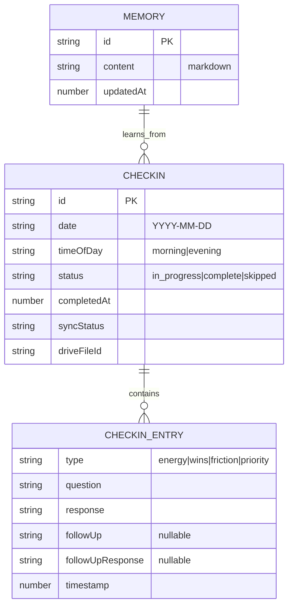

# feat: Phase 4 - Check-ins & Learning Loop

## Overview

Conversational daily check-ins that extract insights and update memory. This phase transforms the placeholder check-in card on the Today page into a guided AI conversation that asks about energy, wins, friction, and the single priority for the day.

**Key Philosophy:** The check-in is therapist-adjacent, not a productivity drill. It asks questions that make you think, probes gently on terse answers, then moves on. No guilt about gaps.

## Problem Statement / Motivation

Users need a structured daily ritual to:
1. Surface how they're actually feeling (not performative "I'm great!")
2. Notice wins they might overlook
3. Name friction without wallowing in it
4. Commit to ONE priority (force the choice)

The current Today page has captures working but the Daily Check-in is a placeholder. Phase 3 delivered AI chat with memory - now we need to use that infrastructure for structured check-ins that extract learnings automatically.

## Proposed Solution

### Architecture Decision: Conversational Check-in

The check-in will be a **specialized chat session** with a state machine, not a form. This reuses the existing `useAIChat` infrastructure while adding check-in-specific behavior:

- Dedicated route: `/today/checkin`
- Check-in-specific system prompt with question sequence
- State tracking for progress through questions
- Memory extraction on completion

### Core Flow

```
User taps "Start check-in" on Today page
  -> Navigate to /today/checkin
  -> AI asks Energy question
  -> User responds (AI may probe once if terse)
  -> AI asks Wins question
  -> User responds (AI may probe once if terse)
  -> AI asks Friction question
  -> User responds (AI may probe once if terse)
  -> AI asks Single Priority question
  -> User responds
  -> Check-in completes
  -> Memory extraction triggered
  -> Navigate back to Today (show completion state)
```

## Technical Considerations

### Schema Updates

**Current schema (needs updating):**
```typescript
export interface CheckinEntry {
  type: 'emotion' | 'highlight' | 'challenge' | 'looking_forward';
  content: string;
  timestamp: number;
}
```

**New schema:**
```typescript
// src/lib/db/schema.ts
export interface CheckinEntry {
  type: 'energy' | 'wins' | 'friction' | 'priority';
  question: string;    // AI's question
  response: string;    // User's response
  followUp?: string;   // AI's follow-up (if terse response)
  followUpResponse?: string;
  timestamp: number;
}

export interface Checkin extends Syncable {
  date: string;                           // YYYY-MM-DD
  timeOfDay: 'morning' | 'evening';       // Based on when started
  status: 'in_progress' | 'complete' | 'skipped';
  entries: CheckinEntry[];
  completedAt?: number;
}
```

### File Structure

```
src/
  lib/
    checkins.ts                    # CRUD operations (new)
    ai/
      prompts.ts                   # Add CHECKIN_SYSTEM_PROMPT
      use-checkin-chat.ts          # Specialized hook (new)
    notifications/
      checkin-reminders.ts         # Local notifications (new)
      reminder-settings.ts         # Settings storage (new)
  routes/
    _app/
      today/
        checkin.tsx                # Check-in conversation route (new)
      today.tsx                    # Update check-in card
  components/
    checkin/
      checkin-card.tsx             # Today page card (new)
      checkin-view.tsx             # Conversation UI (new)
      notification-prompt.tsx      # Soft permission prompt (new)
```

### Check-in State Machine

```
STATES:
  idle -> awaiting_energy -> awaiting_wins -> awaiting_friction -> awaiting_priority -> complete

TRANSITIONS:
  idle + "start" -> awaiting_energy (AI asks energy question)
  awaiting_energy + user_response -> awaiting_wins (or probe_energy if terse)
  probe_energy + user_response -> awaiting_wins
  awaiting_wins + user_response -> awaiting_friction (or probe_wins if terse)
  ...
  awaiting_priority + user_response -> complete

EDGE CASES:
  any + "skip" -> skipped
  any + "abandon" (navigate away) -> in_progress (saved for resume)
  in_progress + "resume" same day -> continue from last state
  in_progress + new day -> discard, start fresh
```

### AI System Prompt for Check-ins

```typescript
// src/lib/ai/prompts.ts
export const CHECKIN_SYSTEM_PROMPT = `You are guiding a daily check-in for Clarity. Your role is to ask 4 questions in sequence, listening deeply to each answer.

## Questions to Ask (in order)
1. ENERGY: "How are you feeling today?" (or "How are you feeling right now?")
2. WINS: "What went well recently?" (or "yesterday" if returning user)
3. FRICTION: "What's been hard or draining?"
4. PRIORITY: "What's the ONE thing you want to focus on today?"

## Conversation Rules
- Ask one question at a time
- After each response, acknowledge briefly before the next question
- Do NOT give advice unless explicitly asked
- Do NOT cheerleader or offer empty encouragement

## Terse Response Handling
If user gives a terse response ("fine", "nothing", "idk", etc.):
1. Probe gently ONCE: "Fine is okay. Anything specific on your mind?"
2. Accept their second answer and move on
3. Never probe more than once per question

## Single Priority Philosophy
For the priority question, if user lists multiple things, gently push:
"I hear several things. If you had to pick ONE - the one that would make today feel successful - what would it be?"

## Context Awareness
{memory_context}

Previous check-ins this week:
{recent_checkins}

## After Gap (3+ days since last check-in)
Start with: "Welcome back. No need to catch up - let's start fresh today."
Then proceed with questions normally.
`;
```

### Memory Integration

After check-in completion, call `extractAndUpdateMemory()` with the full check-in transcript. The extraction should:

- Update **Current Season** if user mentions life changes
- Update **Now/Next/Later** with the stated priority
- Update relevant **Life Domains** based on friction/wins content
- Track patterns in **Cross-Domain Tensions** if friction spans areas

### Notifications

**Dependencies to add:**
```bash
npm install @capacitor/local-notifications
npx cap sync ios
```

**Scheduling:**
- Morning notification: 8:00 AM local time (configurable)
- Evening notification: 8:00 PM local time (configurable)
- Use `schedule.every: 'day'` with `allowWhileIdle: true`

**Soft Permission Flow:**
1. After 3+ completed check-ins, show soft prompt
2. Explain value: "Get gentle reminders for your daily check-in"
3. If user accepts, trigger system permission dialog
4. Store preference in `@capacitor/preferences`

## Acceptance Criteria

### Functional Requirements

- [ ] User can start check-in from Today page card
- [ ] AI asks Energy, Wins, Friction, Priority in sequence
- [ ] Terse responses trigger exactly one gentle probe
- [ ] Check-in completion triggers memory extraction
- [ ] Completed check-in shows summary on Today page
- [ ] User can skip check-in with "Skip today" button
- [ ] Returning after gap shows "Welcome back" message (no catch-up)
- [ ] Check-in persists to Dexie and syncs to Drive

### Non-Functional Requirements

- [ ] Morning check-in completes in < 2 minutes typical
- [ ] Works offline: shows message that AI features require connection
- [ ] Notification scheduling works on iOS (Capacitor)
- [ ] Memory extraction adds < 1 second latency at completion

### Quality Gates

- [ ] TypeScript strict mode passes
- [ ] Check-in schema matches spec types
- [ ] All edge cases from flow analysis handled
- [ ] Haptic feedback on iOS for message send/receive

## Success Metrics

- Check-in completion rate (target: 60%+ of daily opens)
- Time to complete morning check-in (target: < 2 min median)
- Memory updates per check-in (target: 1+ meaningful updates)
- User retention after enabling notifications

## Dependencies & Prerequisites

**Completed (Phase 3):**
- [x] AI chat with streaming (`useAIChat`)
- [x] Memory system (`extractAndUpdateMemory`, `compressMemoryIfNeeded`)
- [x] Dexie schema for `checkins` table
- [x] Google Drive sync infrastructure

**Required for this phase:**
- Schema update for `CheckinEntry` types
- Capacitor local notifications plugin
- Check-in specific AI prompt

## Implementation Phases

### Phase 4.1: Schema & CRUD

**Files to create/modify:**
- `src/lib/db/schema.ts` - Update CheckinEntry types
- `src/lib/checkins.ts` - CRUD operations (new)
- `src/lib/db/hooks.ts` - Add `useTodayCheckin` hook

**Key functions:**
```typescript
// src/lib/checkins.ts
export async function getOrCreateTodayCheckin(): Promise<Checkin>
export async function addCheckinEntry(checkinId: string, entry: CheckinEntry): Promise<void>
export async function completeCheckin(checkinId: string): Promise<void>
export async function skipCheckin(checkinId: string): Promise<void>
```

### Phase 4.2: Check-in Conversation UI

**Files to create:**
- `src/routes/_app/today/checkin.tsx` - Route component
- `src/components/checkin/checkin-view.tsx` - Conversation UI
- `src/lib/ai/use-checkin-chat.ts` - Specialized chat hook
- `src/lib/ai/prompts.ts` - Add CHECKIN_SYSTEM_PROMPT

**State machine implementation:**
```typescript
// src/lib/ai/use-checkin-chat.ts
type CheckinStage = 'energy' | 'wins' | 'friction' | 'priority' | 'complete';

export function useCheckinChat({
  checkinId,
  memoryContext,
  onComplete,
}: UseCheckinChatOptions)
```

### Phase 4.3: Today Page Integration

**Files to modify:**
- `src/routes/_app/today.tsx` - Replace placeholder with CheckinCard
- `src/components/checkin/checkin-card.tsx` - Smart card (new)

**Card states:**
- Not started today: "Start check-in" button
- In progress: "Continue check-in" button with progress
- Completed: Summary with wins/priority

### Phase 4.4: Memory Extraction Integration

**Files to modify:**
- `src/lib/ai/memory-extractor.ts` - Add check-in specific extraction
- `src/components/checkin/checkin-view.tsx` - Trigger on completion

**Extraction prompt enhancement:**
```typescript
const CHECKIN_EXTRACTION_PROMPT = `Given this check-in conversation, extract learnings:
- Energy level and any patterns (e.g., consistently low on Mondays)
- Wins to celebrate (add to relevant Life Domain)
- Friction points (consider Cross-Domain Tensions)
- Today's priority (update Now/Next/Later)

Only extract meaningful updates. Not everything is worth remembering.`;
```

### Phase 4.5: Notifications (Optional Enhancement)

**Files to create:**
- `src/lib/notifications/checkin-reminders.ts`
- `src/components/notification-prompt.tsx`
- `src/routes/_app/settings.tsx` - Add reminder settings

**Native setup:**
- Add `@capacitor/local-notifications` dependency
- Configure Android manifest permissions
- Implement soft permission flow

## Alternative Approaches Considered

### Form-based check-in (Rejected)

**Pros:** Faster, more predictable, works offline

**Cons:** Loses conversational depth, can't adapt to user responses, doesn't match spec's "conversational format"

**Decision:** Use conversational approach per spec. The AI's ability to probe on terse answers and reference context provides unique value.

### Separate morning/evening check-ins (Rejected)

**Pros:** Clearer purpose for each

**Cons:** More friction, users may skip one, complicates schema

**Decision:** One adaptive check-in per day. Time-of-day affects prompt tone, not structure.

### Check-in as modal over Today page (Rejected)

**Pros:** Feels lighter, no navigation

**Cons:** Blocks Today page access, harder to implement resume, cramped on mobile

**Decision:** Dedicated route with full-screen conversation UI.

## ERD



## References & Research

### Internal References
- Spec: `docs/spec.md:495-521` - Check-in system definition
- Current schema: `src/lib/db/schema.ts:17-26`
- Memory extractor: `src/lib/ai/memory-extractor.ts:23-71`
- AI chat hook: `src/lib/ai/use-ai-chat.ts:33-153`
- Chat prompts: `src/lib/ai/prompts.ts:5-43`

### External References
- [Capacitor Local Notifications](https://capacitorjs.com/docs/apis/local-notifications)
- [Vercel AI SDK streamText](https://ai-sdk.dev/docs/reference/ai-sdk-core/stream-text)
- [iOS Notification Best Practices](https://developer.apple.com/design/human-interface-guidelines/managing-notifications)

### Related Work
- Depends on: `clarity-ay6` (Phase 3: AI Chat with Memory) - COMPLETE
- Blocks: `clarity-v51` (Phase 5: Stripe & Subscription)

### UX Patterns Referenced
- Daylio: Two-tap mood + activity logging
- Reflectly: AI-guided journaling prompts
- Best practice: Terse response probing pattern from spec
