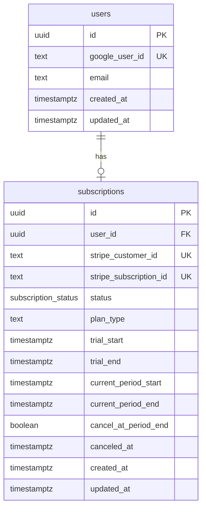

# Phase 5: Stripe & Subscription

## Overview

Implement Stripe Checkout for subscription payments with 7-day card-free trial, subscription status tracking in Supabase, and feature gating for premium access. All payments route through web checkout to avoid Apple's 30% cut.

## Problem Statement

Clarity needs a monetization system that:
- Provides 7-day free trial without requiring credit card
- Supports $10/month or $99/year subscription plans
- Works seamlessly on iOS (via Safari checkout to avoid Apple fees)
- Tracks subscription status server-side in Supabase
- Gates features appropriately for expired trials/subscriptions

## Proposed Solution

### Architecture Overview

```
┌─────────────────┐     ┌─────────────────┐     ┌─────────────────┐
│   Clarity App   │────▶│  Supabase Edge  │────▶│     Stripe      │
│  (React/iOS)    │◀────│   Functions     │◀────│   (Checkout)    │
└─────────────────┘     └─────────────────┘     └─────────────────┘
         │                      │                        │
         │                      ▼                        │
         │              ┌─────────────────┐              │
         └─────────────▶│    Supabase     │◀─────────────┘
                        │   (Database)    │   (webhooks)
                        └─────────────────┘
```

### Key Design Decisions

| Decision | Choice | Rationale |
|----------|--------|-----------|
| Checkout type | Stripe Checkout (hosted) | Simplest, handles compliance, supports trials |
| Payment collection | `if_required` | Enables card-free trial |
| Trial end behavior | `pause` | User-friendly, allows recovery |
| iOS checkout | Safari (external) | Avoids Apple fees per Epic ruling |
| User identity | Google ID → Supabase mapping | Works with existing Google OAuth |
| Feature gating | Complete lockout after trial | Simple, clear value proposition |

---

## Acceptance Criteria

### Must Have
- [ ] User can start 7-day trial without entering credit card
- [ ] User can subscribe via Stripe Checkout (monthly/annual)
- [ ] iOS checkout opens in Safari and returns to app correctly
- [ ] Subscription status stored in Supabase and queryable
- [ ] Expired trial shows subscription-only screen
- [ ] Active subscribers have full app access
- [ ] Webhooks update subscription status in real-time

### Should Have
- [ ] Trial ending reminder (Day 5 banner)
- [ ] Payment failure recovery flow with grace period
- [ ] Manage subscription via Stripe Customer Portal
- [ ] Subscription status syncs across devices

### Nice to Have
- [ ] Analytics events for subscription funnel
- [ ] Subscription status in Settings page
- [ ] Graceful offline handling of status checks

---

## Technical Approach

### Database Schema

```sql
-- supabase/migrations/001_subscriptions.sql

-- User identity mapping (links Google OAuth to Supabase)
create table public.users (
  id uuid primary key default gen_random_uuid(),
  google_user_id text unique not null,
  email text not null,
  created_at timestamptz default now(),
  updated_at timestamptz default now()
);

-- Subscription tracking
create type subscription_status as enum (
  'trialing', 'active', 'past_due', 'canceled', 'paused', 'incomplete'
);

create table public.subscriptions (
  id uuid primary key default gen_random_uuid(),
  user_id uuid references public.users(id) on delete cascade,
  stripe_customer_id text unique,
  stripe_subscription_id text unique,
  status subscription_status not null default 'trialing',
  plan_type text, -- 'monthly' | 'annual'
  trial_start timestamptz,
  trial_end timestamptz,
  current_period_start timestamptz,
  current_period_end timestamptz,
  cancel_at_period_end boolean default false,
  canceled_at timestamptz,
  created_at timestamptz default now(),
  updated_at timestamptz default now()
);

-- Indexes
create index idx_subscriptions_user_id on public.subscriptions(user_id);
create index idx_subscriptions_stripe_customer_id on public.subscriptions(stripe_customer_id);
create index idx_users_google_user_id on public.users(google_user_id);

-- RLS policies
alter table public.users enable row level security;
alter table public.subscriptions enable row level security;

-- Users can only read their own data
create policy "Users can view own record"
  on public.users for select
  using (google_user_id = current_setting('request.jwt.claims')::json->>'google_user_id');

create policy "Users can view own subscription"
  on public.subscriptions for select
  using (user_id in (
    select id from public.users
    where google_user_id = current_setting('request.jwt.claims')::json->>'google_user_id'
  ));
```

### Environment Variables

```bash
# .env additions
STRIPE_SECRET_KEY=sk_live_xxx           # Server-side only
STRIPE_WEBHOOK_SECRET=whsec_xxx         # Server-side only
VITE_STRIPE_PUBLISHABLE_KEY=pk_live_xxx # Client-side
VITE_STRIPE_PRICE_MONTHLY=price_xxx     # Monthly price ID
VITE_STRIPE_PRICE_ANNUAL=price_xxx      # Annual price ID
```

---

## Implementation Phases

### Phase 5A: Foundation (Supabase + Identity)

**Task 1: Create Supabase migration for users/subscriptions tables**

File: `supabase/migrations/001_subscriptions.sql`

- Create `users` table with Google ID mapping
- Create `subscriptions` table with status tracking
- Add RLS policies for user isolation
- Add indexes for query performance

**Task 2: Create user record on first sign-in**

File: `src/lib/auth-context.tsx`

After successful Google OAuth, check if user exists in Supabase. If not, create record:

```typescript
// After Google OAuth success
async function ensureSupabaseUser(googleUser: GoogleUser): Promise<string> {
  const { data: existing } = await supabase
    .from('users')
    .select('id')
    .eq('google_user_id', googleUser.id)
    .single();

  if (existing) return existing.id;

  // Create new user with trial
  const { data: newUser } = await supabase
    .from('users')
    .insert({
      google_user_id: googleUser.id,
      email: googleUser.email,
    })
    .select('id')
    .single();

  // Create trial subscription
  const trialEnd = new Date();
  trialEnd.setDate(trialEnd.getDate() + 7);

  await supabase.from('subscriptions').insert({
    user_id: newUser.id,
    status: 'trialing',
    trial_start: new Date().toISOString(),
    trial_end: trialEnd.toISOString(),
  });

  return newUser.id;
}
```

**Task 3: Create useSubscription hook**

File: `src/lib/stripe/use-subscription.ts`

```typescript
export function useSubscription() {
  const { user } = useAuth();
  const [status, setStatus] = useState<SubscriptionState>({
    status: 'loading',
    trialEndsAt: null,
    isActive: false,
  });

  useEffect(() => {
    if (!user) return;

    // Initial fetch
    fetchSubscriptionStatus(user.id).then(setStatus);

    // Real-time updates via Supabase
    const channel = supabase
      .channel('subscription-changes')
      .on('postgres_changes', {
        event: 'UPDATE',
        schema: 'public',
        table: 'subscriptions',
      }, handleUpdate)
      .subscribe();

    return () => supabase.removeChannel(channel);
  }, [user]);

  return status;
}

export function hasActiveAccess(status: SubscriptionStatus): boolean {
  return ['trialing', 'active'].includes(status);
}
```

---

### Phase 5B: Stripe Integration (Edge Functions)

**Task 4: Create checkout session Edge Function**

File: `supabase/functions/create-checkout-session/index.ts`

```typescript
import Stripe from 'https://esm.sh/stripe@14';
import { createClient } from 'https://esm.sh/@supabase/supabase-js@2';

const stripe = new Stripe(Deno.env.get('STRIPE_SECRET_KEY')!);
const supabase = createClient(
  Deno.env.get('SUPABASE_URL')!,
  Deno.env.get('SUPABASE_SERVICE_ROLE_KEY')!
);

Deno.serve(async (req) => {
  const { priceId, userId, email, returnUrl } = await req.json();

  // Get or create Stripe customer
  const { data: sub } = await supabase
    .from('subscriptions')
    .select('stripe_customer_id')
    .eq('user_id', userId)
    .single();

  let customerId = sub?.stripe_customer_id;

  if (!customerId) {
    const customer = await stripe.customers.create({
      email,
      metadata: { supabase_user_id: userId },
    });
    customerId = customer.id;

    await supabase
      .from('subscriptions')
      .update({ stripe_customer_id: customerId })
      .eq('user_id', userId);
  }

  // Create checkout session with card-free trial
  const session = await stripe.checkout.sessions.create({
    customer: customerId,
    mode: 'subscription',
    line_items: [{ price: priceId, quantity: 1 }],
    payment_method_collection: 'if_required',
    subscription_data: {
      trial_period_days: 7,
      trial_settings: {
        end_behavior: { missing_payment_method: 'pause' },
      },
    },
    success_url: `${returnUrl}?session_id={CHECKOUT_SESSION_ID}&success=true`,
    cancel_url: `${returnUrl}?canceled=true`,
    allow_promotion_codes: true,
  });

  return new Response(JSON.stringify({ url: session.url }));
});
```

**Task 5: Create Stripe webhook handler**

File: `supabase/functions/stripe-webhook/index.ts`

Handle events:
- `checkout.session.completed` - Update subscription after payment
- `customer.subscription.updated` - Status changes
- `customer.subscription.deleted` - Cancellation
- `customer.subscription.trial_will_end` - Trial ending soon
- `invoice.payment_failed` - Payment issues

**Task 6: Create customer portal session Edge Function**

File: `supabase/functions/create-portal-session/index.ts`

For subscription management (cancel, change plan, update payment).

---

### Phase 5C: Client Integration

**Task 7: Create checkout flow**

File: `src/lib/stripe/checkout.ts`

```typescript
import { Browser } from '@capacitor/browser';
import { App } from '@capacitor/app';

export async function openStripeCheckout(options: CheckoutOptions) {
  const response = await fetch(
    `${SUPABASE_URL}/functions/v1/create-checkout-session`,
    {
      method: 'POST',
      headers: {
        'Content-Type': 'application/json',
        'Authorization': `Bearer ${SUPABASE_ANON_KEY}`,
      },
      body: JSON.stringify({
        priceId: options.priceId,
        userId: options.userId,
        email: options.email,
        returnUrl: 'https://obtainclarity.com/checkout-complete',
      }),
    }
  );

  const { url } = await response.json();

  // Open in Safari (external)
  await Browser.open({ url, presentationStyle: 'fullscreen' });
}
```

**Task 8: Handle checkout return**

File: `src/routes/_app.tsx`

Add listener for app foreground to check subscription status after checkout:

```typescript
useEffect(() => {
  const cleanup = App.addListener('appStateChange', async ({ isActive }) => {
    if (isActive && pendingCheckout.current) {
      // Poll subscription status
      await refreshSubscriptionStatus();
      pendingCheckout.current = false;
    }
  });
  return () => cleanup.remove();
}, []);
```

**Task 9: Create subscription/paywall screens**

Files:
- `src/components/subscription/pricing-page.tsx` - Plan selection
- `src/components/subscription/trial-banner.tsx` - Trial countdown
- `src/components/subscription/expired-screen.tsx` - Blocked state

---

### Phase 5D: Feature Gating

**Task 10: Create SubscriptionGate component**

File: `src/components/subscription/subscription-gate.tsx`

```typescript
export function SubscriptionGate({ children }: { children: ReactNode }) {
  const { status, isLoading } = useSubscription();

  if (isLoading) {
    return <LoadingSpinner />;
  }

  if (!hasActiveAccess(status)) {
    return <ExpiredScreen />;
  }

  return <>{children}</>;
}
```

**Task 11: Wrap protected routes**

File: `src/routes/_app.tsx`

```typescript
function AppLayout() {
  return (
    <SubscriptionGate>
      <AppShell>
        <Outlet />
      </AppShell>
    </SubscriptionGate>
  );
}
```

**Task 12: Add subscription management to Settings**

File: `src/routes/_app/settings.tsx`

Add section showing:
- Current plan (Trial/Monthly/Annual)
- Trial end date or renewal date
- "Manage Subscription" button (opens Stripe portal)

---

### Phase 5E: Polish & Edge Cases

**Task 13: Trial ending banner**

Show banner starting Day 5:
- "3 days left in trial - Subscribe now"
- Dismissable but returns next session

**Task 14: Payment failure handling**

- Detect `past_due` status
- Show banner with "Update payment method"
- 7-day grace period before lockout

**Task 15: Account deletion flow**

- Add delete button to Settings
- Auto-cancel subscription on deletion
- Clear local data, sign out

---

## Files to Create/Modify

| File | Action | Purpose |
|------|--------|---------|
| `supabase/migrations/001_subscriptions.sql` | Create | Database schema |
| `supabase/functions/create-checkout-session/index.ts` | Create | Checkout session generation |
| `supabase/functions/stripe-webhook/index.ts` | Create | Webhook handling |
| `supabase/functions/create-portal-session/index.ts` | Create | Portal session generation |
| `src/lib/stripe/checkout.ts` | Create | Client checkout flow |
| `src/lib/stripe/use-subscription.ts` | Create | Subscription status hook |
| `src/components/subscription/pricing-page.tsx` | Create | Plan selection UI |
| `src/components/subscription/trial-banner.tsx` | Create | Trial countdown |
| `src/components/subscription/expired-screen.tsx` | Create | Paywall |
| `src/components/subscription/subscription-gate.tsx` | Create | Feature gating |
| `src/lib/auth-context.tsx` | Modify | Add Supabase user creation |
| `src/routes/_app.tsx` | Modify | Add subscription gate, checkout return handler |
| `src/routes/_app/settings.tsx` | Modify | Add subscription management |
| `.env.example` | Modify | Add Stripe env vars |

---

## ERD



---

## Testing Checklist

### Manual Testing
- [ ] New user sign-in creates trial
- [ ] Trial countdown displays correctly
- [ ] Checkout opens in Safari (iOS)
- [ ] Checkout completion updates status
- [ ] Return to app detects subscription
- [ ] Expired trial shows paywall
- [ ] Manage subscription opens portal
- [ ] Plan change reflects in app
- [ ] Cancellation works correctly
- [ ] Account deletion cancels subscription

### Stripe CLI Testing
```bash
# Forward webhooks locally
stripe listen --forward-to localhost:54321/functions/v1/stripe-webhook

# Trigger test events
stripe trigger checkout.session.completed
stripe trigger customer.subscription.trial_will_end
stripe trigger invoice.payment_failed
```

### Test Cards
| Scenario | Card |
|----------|------|
| Success | 4242424242424242 |
| Requires auth | 4000002500003155 |
| Declined | 4000000000000002 |
| Insufficient funds | 4000000000009995 |

---

## References

### Internal
- `docs/spec.md:710-743` - Business model specification
- `src/lib/auth-context.tsx` - Existing Google OAuth flow
- `src/routes/_app.tsx` - Protected route layout
- `docs/research/phase-5-stripe-subscription-best-practices.md` - Prior research

### External
- [Stripe Checkout Subscriptions](https://docs.stripe.com/billing/subscriptions/build-subscriptions)
- [Free Trials with Checkout](https://docs.stripe.com/payments/checkout/free-trials)
- [Stripe Webhooks](https://docs.stripe.com/webhooks)
- [Supabase Edge Functions](https://supabase.com/docs/guides/functions)
- [iOS Digital Goods (avoid Apple fees)](https://docs.stripe.com/mobile/digital-goods/checkout)

---

## Open Questions (Resolved)

| Question | Decision |
|----------|----------|
| User identity linking? | Create Supabase `users` table mapping Google ID |
| Trial end behavior? | `pause` - user-friendly recovery |
| Feature gating approach? | Complete lockout after trial expiry |
| Webhook events needed? | checkout.session.completed, subscription.updated/deleted, invoice.payment_failed, trial_will_end |
| Deep link scheme? | Use web URL with "Return to app" button, detect via foreground event |
